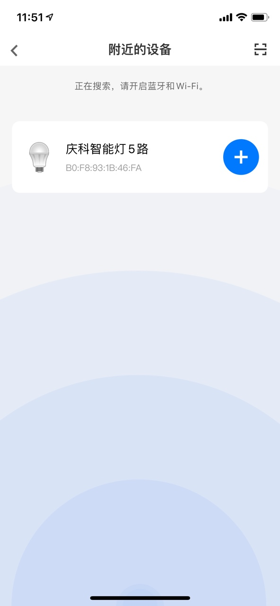

# Breeze蓝牙配网示例

演示了如何使用Breeze协议完成对模块的wifi配网

## 准备工作

手机安装阿里的“云智能”APP，可在全球各主流应用商店搜索“云智能”进行下载。

修改breezeapp.c中的产品三元组信息或者也可以使用demo中的默认设置

```c
#define PRODUCT_ID     2344792
#define DEVICE_SECRET  "Wo0yfVGC9fO2aMdgylkpVEpKff5fXj8s"
#define DEVICE_NAME    "ble_demo"
#define PRODUCT_KEY    "a1CCp8uJFqE"
#define PRODUCT_SECRET "R91CnZsinTXDbID9"
```

编译并下载breezeapp固件，确认固件已经在模块上运行成功。

## 蓝牙配网

1. 打开“云智能”APP，点击右上角加号，添加设备

2. 点击右上角扫描图标，进入搜索附近设备的界面

3. 如果三元组信息正确，并且固件运行正常，APP会自动搜索到名称为“庆科智能灯5路”的设备，如下图所示

4. 点击设备列表中对应设备的加号，进入蓝牙配网流程，填写路由器SSID和密码之后，开始配网

5. 观察设备端日志，会打印breeze连接流程的日志和手机发送过来的路由器SSID、密码，并进行连接


